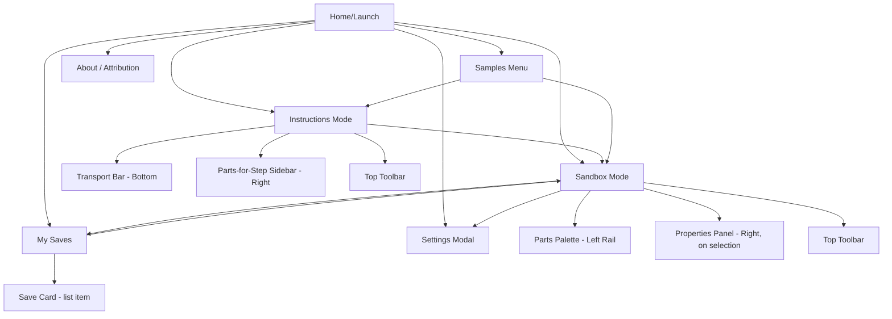
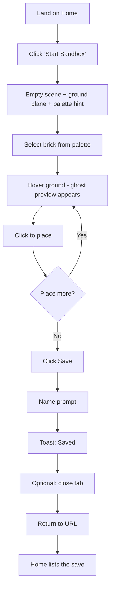
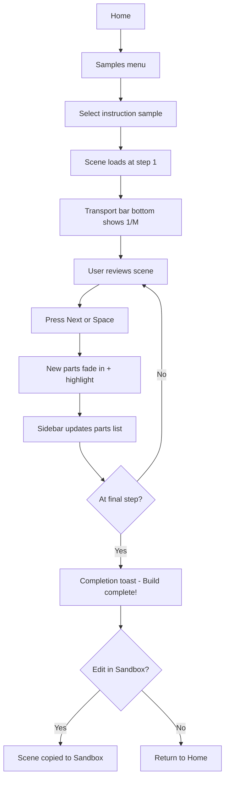
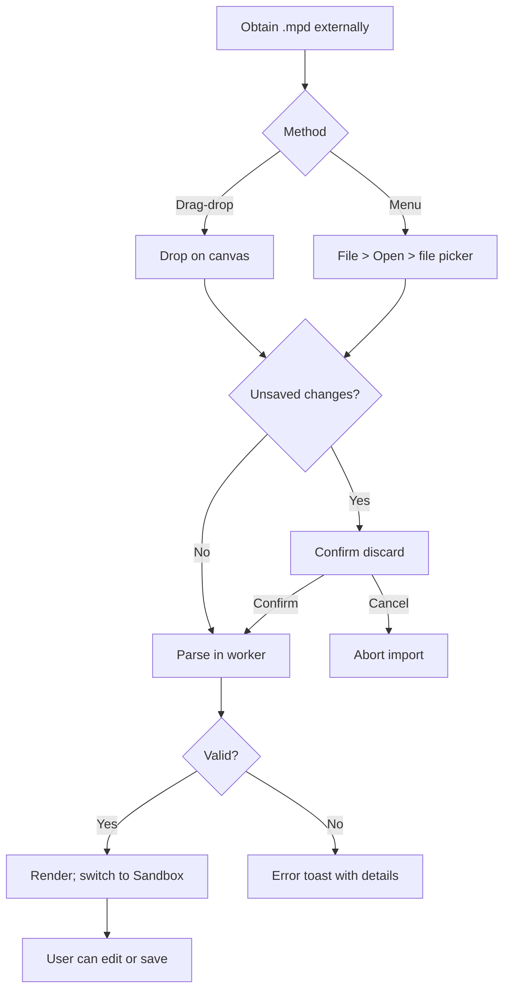

# LegoB UI/UX Specification

**Status:** Draft v1.0 · YOLO autonomous draft by `@ux-design-expert` (aiox-master)
**Date:** 2026-04-19
**Inputs:** `docs/project-brief.md`, `docs/prd.md`

---

## Introduction

This document defines the user experience goals, information architecture, user flows, and visual design specifications for LegoB's user interface. It serves as the foundation for visual design and frontend development, ensuring a cohesive, accessible experience focused on: **place a brick in under 30 seconds, never get stuck, never wait for a spinner on the canvas.**

### Overall UX Goals & Principles

**Target User Personas:**
- **Casual Digital Builder (primary):** non-CAD user who wants to play. Needs discoverable tools, forgiving defaults, satisfying feedback.
- **LDraw Enthusiast (secondary):** knows the format and expects fidelity. Values keyboard shortcuts and file-level import/export.

**Usability Goals:**
- **Ease of learning:** a new user completes the place-rotate-save loop without reading docs.
- **Efficiency:** power users can build via keyboard-first workflow (no mouse-to-menu trips for common actions).
- **Error prevention:** destructive actions (delete, discard) confirm; unsaved-work guard on navigation.
- **Feedback immediacy:** every interaction produces a reaction within 100 ms.
- **Trust:** saves are durable; the app never silently loses work.

**Design Principles:**
1. **Canvas-first.** The 3D scene owns the viewport. Chrome is thin, collapsible, never overlays the build.
2. **Show, don't modal.** Inline panels and toasts over dialogs. Settings is the only modal.
3. **Progressive disclosure.** Beginner sees palette + place. Power features (export, instancing, cache) live in menus.
4. **Keyboard parity.** Every mouse action has a keyboard equivalent; shortcuts are discoverable via tooltip.
5. **Accessible from day one.** WCAG AA on chrome; graphical canvas paired with a textual scene-contents alternative.

### Change Log

| Date | Version | Description | Author |
|------|---------|-------------|--------|
| 2026-04-19 | 1.0 | Initial YOLO draft from PRD | @ux-design-expert (aiox-master) |

---

## Information Architecture (IA)

### Site Map / Screen Inventory



### Navigation Structure

- **Primary navigation:** top toolbar with Mode toggle (Sandbox / Instructions), File (Open, Save, Export), Samples, My Saves, Settings, About.
- **Secondary navigation:** Home screen quick-links; in Sandbox the left rail holds contextual palette navigation.
- **Breadcrumb strategy:** not needed — max depth is 2 (Home → Mode). Top toolbar always provides escape back to Home.

---

## User Flows

### Flow: First-Time Sandbox Build

**User Goal:** Place a few bricks and save the model, having never used the app.

**Entry Points:** Landing page, click "Start Sandbox" OR direct URL deep link.

**Success Criteria:** Model saved; reload preserves it; time-to-first-brick < 30 s.



**Edge Cases & Error Handling:**
- Palette fails to load parts → show inline error in palette with retry button; ground-plane placement disabled.
- Click on ground with no active part → subtle hint toast: "Pick a part from the palette first".
- Save fails (quota) → toast with "Storage full — export as file?" action.
- User closes tab with unsaved changes → `beforeunload` prompt (skippable via setting).

### Flow: Open Instruction Set and Play Through

**User Goal:** Open a sample instruction set and complete the build.

**Entry Points:** Home → Samples menu → pick instruction-compatible sample.

**Success Criteria:** Complete final step; scene matches full model.



**Edge Cases:**
- `.mpd` has no `0 STEP` markers → banner "No steps found; showing full model" + single-step transport.
- User drags scrubber past the end → clamps to last step.
- Step render > 500 ms → inline "Loading step..." indicator (should be rare).
- Switch tabs mid-playback → state preserved; transport picks up where left off.

### Flow: Import External `.mpd` File

**User Goal:** Open an `.mpd` they downloaded elsewhere.

**Entry Points:** Drag-drop on canvas; File → Open menu.

**Success Criteria:** Model renders correctly; user can save a copy.



**Edge Cases:**
- File references unknown parts → placeholder cubes + summary toast "N parts could not be resolved".
- File > 10 MB → confirmation "This is a large file; continue?".
- Corrupt file → error toast with first line of parse error.

---

## Wireframes & Mockups

**Primary Design Files:** Figma (to be created during implementation — not part of greenfield planning phase). The ASCII wireframes below are definitive for layout; visual polish is deferred to the design system refinement during Epic 5.

### Key Screen Layouts

#### Screen: Home / Launch

**Purpose:** One-screen decision point: start a new build, open a save, or try a sample.

```
+-----------------------------------------------------------+
|  LegoB                       [About]  [Settings gear]     |
+-----------------------------------------------------------+
|                                                           |
|                  [ Start Sandbox ]                        |
|                                                           |
|                  [ Open Sample Set ]                      |
|                                                           |
|                  [ Import File...   ]                     |
|                                                           |
|       My Saves (3)                                        |
|       +-------+ +-------+ +-------+                       |
|       | thumb | | thumb | | thumb |                       |
|       | name  | | name  | | name  |                       |
|       | date  | | date  | | date  |                       |
|       +-------+ +-------+ +-------+                       |
|                                                           |
|       LDraw-compatible. No account. Local-only.           |
+-----------------------------------------------------------+
```

**Key Elements:**
- Three primary CTAs stacked center (large hit targets).
- My Saves section visible if saves exist (hidden on first visit).
- Attribution strip at bottom.

**Interaction Notes:**
- Saves click → load directly into Sandbox.
- Empty state for My Saves (first visit): "Your saves will appear here".

---

#### Screen: Sandbox Mode

```
+-----------------------------------------------------------------+
| [Back] [Mode: Sandbox v] [File v] [Save] [Export] [?]  [Set...]|
+-----------+-------------------------------------+---------------+
| Palette   |                                     | Properties    |
| [search]  |                                     |               |
| +-------+ |                                     | Part: 3001    |
| | 2x2br | |                                     | 2x2 Brick     |
| +-------+ |          3D Canvas                  |               |
| | 2x4br | |                                     | Color:        |
| +-------+ |                                     | [red][blue][..|
| | 1x1pl | |                                     |               |
| +-------+ |                                     | Position:     |
| | 2x2pl | |                                     | x:20 y:8 z:0  |
| +-------+ |                                     |               |
|   ...     |                                     | [Rotate]      |
|           |                                     | [Delete]      |
| [Categ v] |                                     |               |
+-----------+-------------------------------------+---------------+
| Status: FPS 60 | Parts: 7 | Saved 2 min ago                     |
+-----------------------------------------------------------------+
```

**Key Elements:**
- Left rail (~240 px) — palette. Collapses to icon strip via `[`.
- Center — canvas, absolute priority. Resizes fluidly.
- Right panel (~280 px) — properties; **only appears on selection**. Otherwise canvas extends full-width.
- Top toolbar — thin (48 px), critical file/mode actions.
- Bottom status bar — thin (24 px), informational only.

**Interaction Notes:**
- Hovering palette shows tooltip with part number + keyboard shortcut if any.
- Dragging a palette entry onto the canvas is a Phase 2 affordance; MVP uses click-then-click.
- Properties panel slides in from right (200 ms ease-out) on selection.

---

#### Screen: Instructions Mode

```
+-----------------------------------------------------------------+
| [Back] [Mode: Instructions v] [Set: Castle.mpd] [Edit in Sandbox]
+-------------------------------------------------+---------------+
|                                                 | Step 3 of 24  |
|                                                 |               |
|                                                 | New parts:    |
|                                                 | [img] 2x4 red  x2
|                                                 | [img] 2x2 tan  x3
|             3D Canvas                           | [img] 1x4 wht  x1
|         (step-in-progress view)                 |               |
|                                                 | Used so far:  |
|                                                 | 18 / 112 parts|
|                                                 |               |
|                                                 | [Ghost: ON ]  |
+-------------------------------------------------+---------------+
| [<<] [<]   Step 3 of 24   [>]  [>>]  [Scrubber =======------]   |
+-----------------------------------------------------------------+
```

**Key Elements:**
- Top toolbar (48 px) — Back, mode toggle, current set name, "Edit in Sandbox" escape hatch.
- Right sidebar (~280 px) — parts-for-step list + totals + ghost toggle.
- Bottom transport (56 px) — prev/next/play/reset + step scrubber.
- Canvas fills remaining space.

**Interaction Notes:**
- Space = play/pause auto-advance (2 s per step); arrow keys step manually.
- Current step parts fade in (300 ms) + outline pulse (2 s).
- "Edit in Sandbox" copies current partial scene into a new Sandbox session — original unchanged.

---

#### Screen: My Saves

```
+-----------------------------------------------------------------+
| [Back to Home] My Saves                       [Sort: Recent v] |
+-----------------------------------------------------------------+
| +----------+ +----------+ +----------+ +----------+             |
| | thumb    | | thumb    | | thumb    | | thumb    |             |
| |          | |          | |          | |          |             |
| | Castle   | | Spaceshp | | House    | | Untitled |             |
| | 2d ago   | | 5d ago   | | 2w ago   | | 1m ago   |             |
| | ... menu | | ... menu | | ... menu | | ... menu |             |
| +----------+ +----------+ +----------+ +----------+             |
|                                                                 |
|  ... more                                                       |
+-----------------------------------------------------------------+
```

**Key Elements:**
- Grid of save cards (160 px × 200 px).
- Per-card actions menu: Load, Rename, Duplicate, Export, Delete.
- Sort control: Recent / Name / Size.
- Empty state with "Create your first build" CTA.

---

## Component Library / Design System

### Design System Approach

**Approach:** Build a small custom system on top of **Radix UI primitives** (unstyled, accessible) + **Tailwind CSS** for layout/theming. Three.js canvas components live in a separate namespace and are not part of the DS. Rationale: MVP scope doesn't justify a full DS, but Radix guarantees accessibility for interactive chrome.

### Core Components

#### Button

- **Purpose:** Primary action trigger.
- **Variants:** primary (solid blue), secondary (outline), ghost (text-only), destructive (red, used for Delete).
- **States:** default, hover, active, disabled, focus-visible, loading.
- **Usage:** All toolbar + modal actions.

#### Icon Button

- **Purpose:** Compact action for toolbars.
- **Variants:** sizes sm (24px) / md (32px); same color variants as Button.
- **States:** default, hover (tooltip), active, disabled, pressed (toggle), focus-visible.
- **Usage:** Toolbars, palette filters.

#### Palette Entry

- **Purpose:** Selectable part in left rail.
- **Variants:** default, active (selected as placement part), hovered.
- **States:** default, hover, active, focus-visible, disabled (part failed to load).
- **Usage:** Parts palette.

#### Property Row

- **Purpose:** Key-value pair in right properties panel.
- **Variants:** read-only (position), editable (color via swatch grid, rotation via steppers).
- **States:** default, edited (temporary highlight on change), error (invalid value).
- **Usage:** Right properties panel.

#### Color Swatch Grid

- **Purpose:** LDConfig color picker.
- **Variants:** grouped by material class (solid, transparent, chrome, pearl).
- **States:** default, hover, selected, disabled (unavailable in LDConfig).
- **Usage:** Color property edit.

#### Transport Bar

- **Purpose:** Instruction playback control.
- **States:** disabled (no steps), paused, playing, at-start, at-end.
- **Usage:** Instructions mode bottom bar.

#### Toast

- **Purpose:** Non-blocking feedback.
- **Variants:** info (blue), success (green), warning (amber), error (red).
- **States:** entering (slide-up 200 ms), visible (5 s default), dismissing (fade-out 200 ms), actionable (persistent with button).
- **Usage:** Save/load results, parse errors, storage warnings.

#### Save Card

- **Purpose:** My Saves entry.
- **States:** default, hover (elevation lift), menu-open.
- **Usage:** My Saves grid.

#### Modal (Settings)

- **Purpose:** Non-blocking settings surface.
- **Usage:** Only for Settings and About. All other UI inline.

---

## Branding & Style Guide

### Visual Identity

**Brand Guidelines:** Pre-legal-review. "LegoB" is a codename. User-facing copy uses "Brick Builder" placeholder. No LEGO logo, no minifigure trade dress.

### Color Palette

| Color Type | Hex Code | Usage |
|-----------|----------|-------|
| Primary | #2563EB | Primary CTAs, active states, focus ring |
| Secondary | #64748B | Secondary text, borders |
| Accent | #F59E0B | Highlights, step-added outline |
| Success | #10B981 | Save confirmations |
| Warning | #F59E0B | Storage warnings, unknown parts |
| Error | #EF4444 | Parse failures, delete prompts |
| Neutral | #0F172A → #F8FAFC | Background scale (dark → light), 10-step |

**Canvas colors** are LDraw-authoritative (from LDConfig) — not part of the UI palette. UI chrome stays neutral so bricks pop.

### Typography

#### Font Families

- **Primary:** Inter (`ui-sans-serif, Inter, system-ui, ...`).
- **Secondary:** Same as primary (simplicity).
- **Monospace:** `ui-monospace, Menlo, Consolas, ...` — used for part numbers, coordinates, debug overlays.

#### Type Scale

| Element | Size | Weight | Line Height |
|---------|------|--------|-------------|
| H1 | 28 px | 700 | 1.2 |
| H2 | 22 px | 600 | 1.3 |
| H3 | 18 px | 600 | 1.4 |
| Body | 14 px | 400 | 1.5 |
| Small | 12 px | 400 | 1.4 |

### Iconography

**Icon Library:** **Lucide** (open MIT, comprehensive, matches visual weight of Inter).

**Usage Guidelines:** 1.5 px stroke. Size tokens: 16/20/24. Icons never the sole indicator — always paired with label or aria-label.

### Spacing & Layout

**Grid System:** 8 px base unit; spacing scale `[2, 4, 8, 12, 16, 24, 32, 48, 64]` px. No CSS grid for main layout — flex with Tailwind utility classes.

**Spacing Scale:** tight (4), default (8), loose (16), section (24).

---

## Accessibility Requirements

### Compliance Target

**Standard:** WCAG 2.1 Level AA for UI chrome; canvas content documented with textual alternative (scene-contents list accessible via "View scene as list" button or `aria-label` summary).

### Key Requirements

**Visual:**
- Color contrast 4.5:1 for normal text, 3:1 for large text and UI elements.
- Focus indicator: 2 px solid ring in primary color, 2 px offset.
- Text sizing: rem-based; respects browser zoom to 200%.

**Interaction:**
- Keyboard navigation: tab order matches visual order; no keyboard traps except inside Settings modal (which Escape exits).
- Screen reader support: all controls have accessible names; state (selected, active, disabled) conveyed via ARIA.
- Touch targets: min 44×44 px on touch devices.

**Content:**
- Alt text: palette thumbnails have `alt="{part number} — {name}"`.
- Heading structure: H1 per screen; logical H2/H3 hierarchy in panels.
- Form labels: every input has a visible label or `aria-label`.

### Testing Strategy

- **Automated:** `@axe-core/react` in dev; CI gate on `vitest-axe` integration tests for key screens.
- **Manual:** Keyboard-only walkthrough per release; NVDA or VoiceOver spot-check on Home, Sandbox, Instructions.
- **User testing:** optional post-MVP; not blocking launch.

---

## Responsiveness Strategy

### Breakpoints

| Breakpoint | Min Width | Max Width | Target Devices |
|-----------|-----------|-----------|---------------|
| Mobile | 0 | 767 px | Phone |
| Tablet | 768 px | 1023 px | Tablet portrait |
| Desktop | 1024 px | 1439 px | Laptop |
| Wide | 1440 px | — | Large monitors |

### Adaptation Patterns

**Layout Changes:**
- Mobile → read-only preview screen with "Best on desktop" banner. All editing hidden.
- Tablet → left palette collapses to icon strip; right panel becomes a bottom sheet.
- Desktop → default layout as wireframed.
- Wide → max-width 1600 px centered; extra space becomes letterboxing.

**Navigation Changes:** Top toolbar icons only (no labels) below 1024 px. Hamburger for secondary nav < 1024 px.

**Content Priority:** Canvas always dominant. Palette and properties panels degrade gracefully into collapsible drawers.

**Interaction Changes:** Touch devices: tap-to-select; long-press for contextual menu. Mouse devices: click-select; hover tooltips; right-click context menu (Phase 2).

---

## Animation & Micro-interactions

### Motion Principles

- **Purposeful.** Animations communicate state change, not decoration.
- **Fast.** Target 200 ms for most transitions, 300 ms for content entering, never > 400 ms.
- **Reduced-motion aware.** All non-essential motion disabled by `prefers-reduced-motion`.
- **Interruptible.** User actions preempt animations cleanly.

### Key Animations

- **Properties panel slide-in:** 200 ms, ease-out, on selection.
- **Palette filter fade:** 150 ms, linear, on search-term change.
- **Step playback fade-in:** 300 ms, ease-out, for newly added parts.
- **Step highlight pulse:** 2 s, 2× pulse, auto-fade.
- **Ghost preview fade:** 100 ms, linear, on hover snap-target change.
- **Toast slide-up:** 200 ms, cubic-bezier(0.2, 0, 0, 1), from bottom-right.
- **Modal fade+scale-in:** 150 ms, ease-out, scale 0.98 → 1.
- **Camera reset:** 400 ms, ease-in-out interpolation of camera position.

---

## Performance Considerations

### Performance Goals

- **Page Load:** P50 ≤ 2 s, P95 ≤ 5 s first visit (cold cache, broadband).
- **Interaction Response:** ≤ 100 ms from click to visible feedback.
- **Animation FPS:** Target 60 fps for UI chrome transitions; scene FPS per NFR3 (60/500 bricks).

### Design Strategies

- **Thumbnails pre-rendered** (SVG or PNG atlased) rather than live-rendered in the palette.
- **Virtualized lists** in My Saves and palette (windowing) for scalability.
- **Skeleton loaders** for palette entries and My Saves cards during fetch.
- **No full-canvas spinners** — all feedback is in-chrome (toasts, inline skeletons).
- **Minimize canvas re-renders** — use React Three Fiber's on-demand rendering when idle.

---

## Keyboard Shortcut Map

| Shortcut | Action | Mode |
|---------|--------|------|
| `Esc` | Deselect / close modal | All |
| `?` | Show shortcuts overlay | All |
| `Ctrl/Cmd + S` | Save | Sandbox |
| `Ctrl/Cmd + O` | Open file | All |
| `Ctrl/Cmd + E` | Export .mpd | Sandbox |
| `Ctrl/Cmd + Z` / `Shift+Z` | Undo / Redo (Phase 2, noted here) | Sandbox |
| `R` | Rotate selected CW | Sandbox |
| `Shift + R` | Rotate selected CCW | Sandbox |
| `Del` / `Backspace` | Delete selected | Sandbox |
| `C` | Open color picker | Sandbox |
| `[` / `]` | Collapse / expand left rail | Sandbox |
| `F` | Reset camera | All |
| `Space` | Play/pause instructions | Instructions |
| `←` / `→` | Prev / next step | Instructions |
| `Home` / `End` | First / last step | Instructions |
| `G` | Toggle ghost preview | Instructions |

---

## Next Steps

### Immediate Actions

1. Hand spec to `@architect` for `docs/fullstack-architecture.md`.
2. `@po` validates spec + PRD + brief cross-consistency.
3. Post-validation, `@sm` consumes sharded docs to begin Story 1.1.

### Design Handoff Checklist

- [x] All user flows documented
- [x] Component inventory complete
- [x] Accessibility requirements defined
- [x] Responsive strategy clear
- [x] Brand guidelines incorporated (placeholder; pending legal)
- [x] Performance goals established
- [ ] Figma mockups (deferred to implementation phase; wireframes above are authoritative)

---

## Checklist Results

_To be populated by `@po` during cross-artifact validation._
