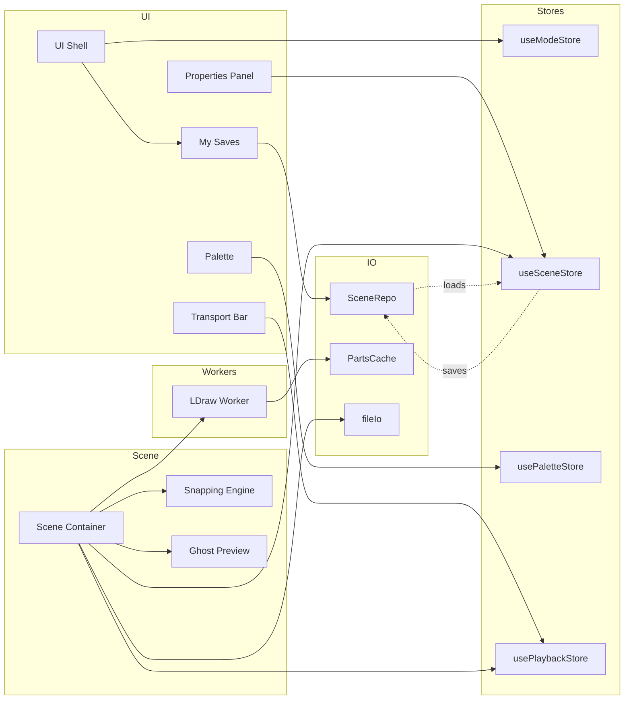
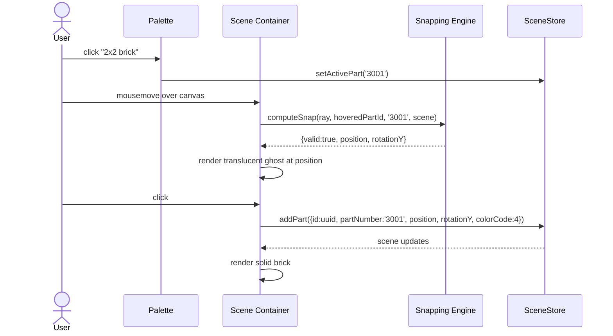
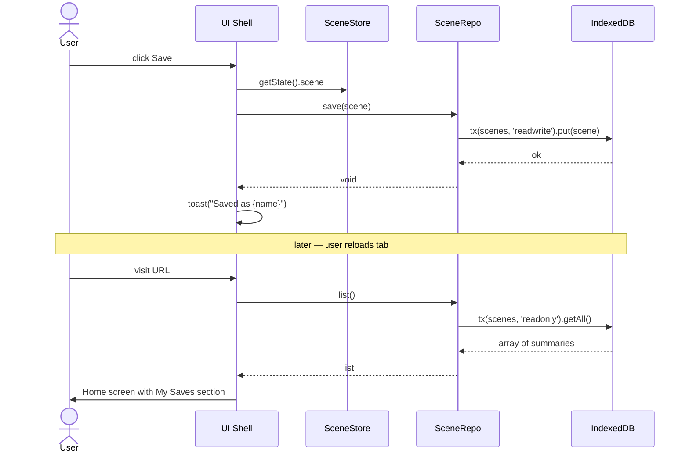

# LegoB Fullstack Architecture Document

**Status:** Draft v1.0 · YOLO autonomous draft by `@architect` (aiox-master)
**Date:** 2026-04-19
**Inputs:** `docs/project-brief.md`, `docs/prd.md`, `docs/front-end-spec.md`, `.aiox/research/ldraw-three-research.md`

---

## Introduction

This document outlines the complete architecture for **LegoB**, a browser-based 3D Lego assembly game. It is intentionally a **frontend-only architecture** — the project explicitly has no backend — but we use the "fullstack" template because the document covers everything a full-stack doc would (data model, API/contract, deployment) with the "backend" slots mapped to browser primitives (IndexedDB, OPFS, Web Workers, Service Worker).

This unified document is the single source of technical truth for AI-driven development agents (`@dev`, `@qa`) working on this project.

### Starter Template or Existing Project

**Decision:** Use the official **Vite `react-ts` template** as the starting scaffold (`npm create vite@latest legob -- --template react-ts`).

**Rationale:**
- Minimal surface area — no opinions beyond Vite + React + TS.
- First-class Web Worker support (`new Worker(new URL('./worker.ts', import.meta.url))`).
- Dev server hot-reload suits iterative 3D work.
- Production build tree-shakes Three.js aggressively.

Rejected alternatives: Next.js (SSR adds no value for a client-only SPA; unnecessary build complexity); Remix (same as Next); from-scratch Webpack (cost with no benefit).

### Change Log

| Date | Version | Description | Author |
|------|---------|-------------|--------|
| 2026-04-19 | 1.0 | Initial architecture from PRD + spec + research | @architect (aiox-master) |

---

## High Level Architecture

### Technical Summary

LegoB is a **pure-client SPA** served as static files from Cloudflare Pages. The React 18 UI is built with Vite, state is held in Zustand stores, and the 3D canvas is rendered via `@react-three/fiber` wrapping Three.js. LDraw parsing runs in a dedicated **Web Worker** that uses `LDrawLoader`, returns a structured scene descriptor to the main thread, and caches part files in **OPFS**. Scene data persists to **IndexedDB** via `idb`. A service worker caches the app shell for offline use. CI/CD is GitHub Actions → Cloudflare Pages with preview-per-PR. The architecture achieves the PRD's NFRs — 60 fps at 500 bricks, < 3 MB gzipped initial payload, crash-free sessions ≥ 98% — by keeping parsing off the main thread, instancing repeated parts, and avoiding any network round-trip after first load.

### Platform and Infrastructure Choice

**Platform:** Cloudflare Pages (production) + GitHub Actions (CI).

**Key Services:**
- **Cloudflare Pages** — static hosting + CDN + preview deploys + custom domain.
- **jsDelivr (GitHub mirror of `ldraw/`-style parts repo)** — first-fetch source for LDraw parts library.
- **GitHub Actions** — lint, typecheck, test, build, deploy.

**Deployment Host and Regions:** Cloudflare global edge (200+ POPs). No region choice needed.

**Rationale:**
- Free tier covers MVP traffic.
- Instant global edge CDN — helps TTFB NFR.
- Zero backend aligns with brief constraint.
- PR preview URLs support UX iteration.

Alternatives considered: Vercel (same tier; picked Cloudflare for simpler bandwidth terms), GitHub Pages (OK but no edge caching tier), Netlify (equivalent; Cloudflare wins on bandwidth).

### Repository Structure

**Structure:** Single-package repo (no monorepo) for MVP. Upgrade to pnpm workspaces in Phase 2 if an embed widget or shared package is introduced.

**Monorepo Tool:** N/A for MVP.

**Package Organization:**
- `src/` — all app code (feature-based folders)
- `src/workers/` — Web Worker entry points
- `src/scene/` — Three.js / R3F code
- `src/ui/` — React chrome components
- `src/state/` — Zustand stores
- `src/io/` — persistence (idb, OPFS, File System Access)
- `public/samples/` — bundled `.mpd` sample sets

### High Level Architecture Diagram

```mermaid
graph TB
    subgraph Browser["Browser Runtime"]
        subgraph MainThread["Main Thread"]
            UI[React UI Chrome<br/>+ Radix + Tailwind]
            R3F[@react-three/fiber<br/>Scene Graph]
            STATE[Zustand Stores<br/>scene, palette, playback]
            IO[Persistence Layer<br/>idb + OPFS + FS Access]
        end

        subgraph Workers["Worker Threads"]
            WORKER[LDraw Worker<br/>LDrawLoader + fetch]
            SW[Service Worker<br/>app shell cache]
        end

        subgraph Storage["Browser Storage"]
            IDB[(IndexedDB<br/>scenes + metadata)]
            OPFS[(OPFS<br/>parts cache)]
            CACHE[(Cache API<br/>app shell)]
        end
    end

    subgraph CDN["Cloudflare Edge"]
        APP[App Shell<br/>HTML/CSS/JS]
    end

    subgraph Parts["LDraw Parts CDN"]
        PARTS[jsDelivr mirror<br/>ldraw parts + LDConfig]
    end

    USER[User] --> UI
    UI <--> R3F
    UI <--> STATE
    R3F <--> STATE
    UI --> IO
    IO <--> IDB
    WORKER <--> OPFS
    WORKER --> PARTS
    SW <--> CACHE
    APP --> SW
    APP --> UI
    UI -.load model.-> WORKER
    WORKER -.geometry.-> R3F
    STATE -.serialize.-> IO
```

### Architectural Patterns

- **Client-Only SPA:** no backend; all compute in the browser. _Rationale:_ brief mandates zero infra cost and local-only persistence.
- **Worker-Offloaded Parsing:** LDraw parse/resolve runs in a dedicated worker; main thread gets structured geometry + step metadata. _Rationale:_ NFR10 requires UI to stay responsive; `.mpd` files can be 10k+ lines.
- **Component-Based UI (React):** React 18 + functional components + hooks; `@react-three/fiber` for declarative 3D. _Rationale:_ community depth, AI tooling support, fiber's reconciler is ideal for scene-as-state.
- **Unidirectional State (Zustand):** Zustand stores own app state; components subscribe via selectors. _Rationale:_ avoids prop-drilling and boilerplate; cheaper than Redux for this scale.
- **Repository Pattern for Persistence:** single `sceneRepo` abstracting idb/OPFS so stores never touch the storage API directly. _Rationale:_ testability; lets us swap idb for Dexie if needed.
- **Instanced Rendering:** `InstancedMesh` for parts appearing ≥ 4 times in a scene. _Rationale:_ NFR3 (FPS ≥ 60 at 500 bricks, ≥ 30 at 1000).
- **Progressive Caching:** first-fetch from CDN → write to OPFS → serve from OPFS forever. _Rationale:_ offline-after-first-load + TTFB for returning visits.
- **Progressive Enhancement:** File System Access API where available, download fallback elsewhere. _Rationale:_ FR8/FR9 work across browsers without forking code.

---

## Tech Stack

This is the **definitive** tech selection. All development uses these exact choices.

### Technology Stack Table

| Category | Technology | Version | Purpose | Rationale |
|----------|-----------|---------|---------|-----------|
| Frontend Language | TypeScript | 5.4+ | Type safety, IDE support | PRD requirement; strict mode |
| Frontend Framework | React | 18.3+ | UI runtime | Community, AI tooling, fiber compatibility |
| UI Primitives | Radix UI | 1.x | Accessible unstyled components | WCAG AA out-of-box; no component fight |
| Styling | Tailwind CSS | 3.4+ | Utility styling | Fast iteration; small bundle when purged |
| State | Zustand | 4.5+ | App state | Minimal boilerplate, scales to scene graph |
| 3D Runtime | Three.js | 0.160+ (pinned) | WebGL rendering | De facto; LDrawLoader source |
| 3D React bridge | @react-three/fiber | 8.15+ | Declarative R3F | Scene-as-component; Suspense for async loads |
| 3D Helpers | @react-three/drei | 9.x | OrbitControls, Stats, etc. | Battery-included extras |
| LDraw Loader | three LDrawLoader | bundled w/ three | Parse LDraw format | Research confirms sufficient for MVP |
| Persistence wrapper | idb | 8.x | IndexedDB ergonomics | Tiny, Promise-based |
| File IO | File System Access API | native | Save/Open files (Chromium) | FR8/FR9; graceful fallback |
| Icons | Lucide React | latest | Icon set | MIT; matches Inter weight |
| Bundler / Dev Server | Vite | 5.x | Dev + build | Speed; worker support; tree-shakes |
| Unit Testing | Vitest | 1.x | Tests | Vite-native; fast |
| DOM Testing | happy-dom | 14.x | jsdom alternative | Faster cold start |
| E2E Testing | Playwright | 1.4x | Integration + visual | Chromium focus matches target |
| Visual Diff | pixelmatch | 5.x | Canvas screenshot diff | Cheap; deterministic |
| A11y Testing | @axe-core/react | 4.x | Runtime a11y checks | Dev-mode gate |
| Linting | ESLint | 8.x (or 9 flat) | Lint | Standard |
| Formatting | Prettier | 3.x | Format | Zero-config |
| CI | GitHub Actions | — | Lint/test/deploy | Free for public repos |
| Hosting | Cloudflare Pages | — | Static hosting + edge | $0/mo + global CDN |
| Error Tracking | console only (MVP) | — | Logs | Sentry-lite is post-MVP |
| Package Manager | npm | ≥ 10 | Dependency mgmt | Ships with Node; simpler than pnpm for single package |
| Node runtime | Node.js | 20 LTS | Build-time only | Per engines field |

Explicitly NOT in stack: Next.js, GraphQL, Redux, any CSS-in-JS runtime, any backend framework, any database server, Docker.

---

## Data Models

Client-only models. TypeScript interfaces live in `src/types/`.

### Part

**Purpose:** A single brick placed in the scene.

**Key Attributes:**
- `id`: `string` — stable UUID, stable across saves.
- `partNumber`: `string` — LDraw part filename without `.dat` (e.g. `"3001"` for 2x2 brick).
- `colorCode`: `number` — LDConfig integer (e.g. `4` for red).
- `position`: `[number, number, number]` — LDU coordinates (x/y/z).
- `rotationY`: `0 | 90 | 180 | 270` — quantized Y rotation; other axes fixed in MVP.
- `stepIndex`: `number | null` — which step introduces this part in Instructions mode; `null` in pure Sandbox.

#### TypeScript Interface

```typescript
export interface Part {
  id: string;
  partNumber: string;
  colorCode: number;
  position: readonly [number, number, number];
  rotationY: 0 | 90 | 180 | 270;
  stepIndex: number | null;
}
```

#### Relationships

- **belongsTo:** `Scene`
- **belongsTo:** `Step` (via `stepIndex` when in Instructions mode)

### Scene

**Purpose:** A full user creation: the model + metadata.

**Key Attributes:**
- `id`: `string` — UUID.
- `name`: `string` — user-provided.
- `parts`: `Part[]` — model contents.
- `steps`: `Step[]` — optional step groupings (present when imported from a stepped `.mpd`).
- `mode`: `'sandbox' | 'instructions'` — which mode last edited it; affects UI on load.
- `createdAt`: `number` — ms epoch.
- `updatedAt`: `number` — ms epoch.
- `thumbnail`: `string | null` — base64 PNG of scene snapshot for the Saves grid.
- `schemaVersion`: `number` — integer; bumped when Part/Scene shape changes.

#### TypeScript Interface

```typescript
export interface Scene {
  id: string;
  name: string;
  parts: Part[];
  steps: Step[];
  mode: 'sandbox' | 'instructions';
  createdAt: number;
  updatedAt: number;
  thumbnail: string | null;
  schemaVersion: number;
}
```

#### Relationships

- **hasMany:** `Part`
- **hasMany:** `Step`

### Step

**Purpose:** A group of parts introduced together in Instructions mode. Populated from `0 STEP` markers on import.

**Key Attributes:**
- `index`: `number` — 0-based step ordinal.
- `partIds`: `string[]` — IDs of parts added in this step.
- `rotationHint`: `[number, number, number] | null` — from `0 ROTSTEP`, if present.

#### TypeScript Interface

```typescript
export interface Step {
  index: number;
  partIds: string[];
  rotationHint: readonly [number, number, number] | null;
}
```

#### Relationships

- **hasMany:** `Part` (by ID)
- **belongsTo:** `Scene`

### LdrawColor

**Purpose:** Cached LDConfig color definition used by UI (palette picker) and renderer.

**Key Attributes:**
- `code`: `number` — LDraw integer code.
- `name`: `string` — human-readable.
- `rgb`: `string` — `#rrggbb`.
- `material`: `'solid' | 'transparent' | 'chrome' | 'pearl' | 'rubber' | 'glitter' | 'metallic'`.
- `alpha`: `number` — 0–1 (for transparent).

#### TypeScript Interface

```typescript
export interface LdrawColor {
  code: number;
  name: string;
  rgb: string;
  material: 'solid' | 'transparent' | 'chrome' | 'pearl' | 'rubber' | 'glitter' | 'metallic';
  alpha: number;
}
```

### PaletteEntry

**Purpose:** A curated part in the palette (subset of the full LDraw library).

**Key Attributes:**
- `partNumber`: `string`
- `displayName`: `string`
- `category`: `'brick' | 'plate' | 'tile' | 'slope' | 'special'`
- `thumbnailUrl`: `string` — pre-rendered PNG or SVG path.
- `defaultColorCode`: `number` — fallback color when placed.

---

## API Specification

**No HTTP API.** All IO is local. This section documents the **in-process contracts** between main thread ↔ workers ↔ storage layers. These are effectively the "API" of LegoB.

### Main Thread ↔ LDraw Worker Protocol

**Transport:** `Worker.postMessage` with structured cloning. Typed via shared TypeScript discriminated union.

```typescript
// main → worker
export type LdrawRequest =
  | { type: 'load'; requestId: string; source: { kind: 'url'; url: string } | { kind: 'text'; text: string } }
  | { type: 'cancel'; requestId: string };

// worker → main
export type LdrawResponse =
  | { type: 'progress'; requestId: string; phase: 'fetching' | 'parsing' | 'resolving'; fraction: number }
  | { type: 'success'; requestId: string; payload: LdrawParseResult }
  | { type: 'error'; requestId: string; code: LdrawErrorCode; message: string; line?: number };

export interface LdrawParseResult {
  parts: Part[];                 // resolved parts with positions baked to world space
  steps: Step[];                 // from 0 STEP markers
  usedPartNumbers: string[];     // for part-cache warm-up + unknown-part warnings
  usedColorCodes: number[];
  bounds: { min: [number,number,number]; max: [number,number,number] };
  warnings: Array<{ code: string; message: string }>;
}

export type LdrawErrorCode = 'fetch_failed' | 'parse_failed' | 'worker_unavailable' | 'cancelled';
```

**Invariants:**
- `requestId` is echoed on every response so UI can correlate and cancel.
- `progress` is informational only; success is authoritative.
- Only one `success` OR one `error` per `requestId`; worker then goes idle.

### Persistence Layer API

```typescript
// src/io/sceneRepo.ts
export interface SceneRepo {
  save(scene: Scene): Promise<void>;              // upsert by id
  load(id: string): Promise<Scene | null>;
  list(): Promise<Array<Pick<Scene, 'id' | 'name' | 'updatedAt' | 'thumbnail'>>>;
  delete(id: string): Promise<void>;
  exportMpd(scene: Scene): Promise<Blob>;         // uses writer util
  importMpd(text: string): Promise<Scene>;        // delegates to worker
}

// src/io/partsCache.ts
export interface PartsCache {
  get(partNumber: string): Promise<string | null>;       // returns .dat text or null
  put(partNumber: string, text: string): Promise<void>;
  has(partNumber: string): Promise<boolean>;
  size(): Promise<number>;                               // bytes
  clear(): Promise<void>;
}
```

### File IO

```typescript
// src/io/fileIo.ts
export async function saveFile(blob: Blob, suggestedName: string): Promise<'saved' | 'downloaded' | 'cancelled'>;
export async function openFile(accept: string): Promise<{ text: string; name: string } | null>;
```

Implementation: `showSaveFilePicker` / `showOpenFilePicker` on Chromium → fallback to anchor download / `<input type="file">` elsewhere. User cancellation is a normal outcome, not an error.

---

## Components

### UI Shell

**Responsibility:** Root React app; renders the top toolbar, mode-dependent layout, and routes between Home / Sandbox / Instructions / My Saves views.

**Key Interfaces:**
- Subscribes to `useModeStore()` (`sandbox | instructions | home | saves | settings`).
- Dispatches mode switches and modal open/close.

**Dependencies:** React Router (or a trivial in-store route state — defer Router addition unless > 4 routes).

**Technology Stack:** React 18, Radix UI, Tailwind.

### Scene Container

**Responsibility:** Owns the `@react-three/fiber` canvas and wires R3F state to Zustand. Chooses between Sandbox-scene and Instructions-scene subtrees based on mode.

**Key Interfaces:** Reads `useSceneStore()`, `usePlaybackStore()`, `usePaletteStore()`. Emits pointer events to the snapping logic.

**Dependencies:** Three.js, fiber, drei.

**Technology Stack:** R3F + drei `<OrbitControls>`, `<Stats>` (dev only).

### LDraw Worker

**Responsibility:** All LDraw parsing. Exposes the request/response protocol above.

**Key Interfaces:** `postMessage(LdrawRequest)` / `onmessage: LdrawResponse`.

**Dependencies:** Three.js's `LDrawLoader`, `PartsCache` (OPFS side), network fetch.

**Technology Stack:** TypeScript worker built by Vite, `new Worker(new URL('./ldrawWorker.ts', import.meta.url), { type: 'module' })`.

### Snapping Engine

**Responsibility:** Given a pointer ray + the active part + current scene, compute the snapped placement position (or reject with a "no valid snap" result). Runs on main thread.

**Key Interfaces:**
```typescript
export function computeSnap(args: {
  ray: THREE.Ray;
  hoveredPartId: string | null;
  activePartNumber: string;
  scene: Scene;
}): { position: [number,number,number]; rotationY: 0|90|180|270; valid: true } | { valid: false; reason: string };
```

**Algorithm (MVP baseline):**
1. If ray hits the ground plane → round x/z to nearest multiple of 10 LDU; y = 0.
2. If ray hits an existing brick's top surface → compute hit.x/hit.z; find nearest known stud position of that part (pre-computed map keyed by `partNumber`); snap to it; y = brick.y + brick.height (20 or 24 or 8 depending on type).
3. Validate no collision with existing parts' bounding boxes at the proposed position.
4. Return valid result with position + default rotation (0°).
5. If all fail → `{ valid: false, reason: 'no snap target' }`.

**Dependencies:** Three.js math, scene snapshot from store, stud-positions lookup table derived from part geometry on first parse.

**Technology Stack:** Pure TS + Three.js math utilities.

### Palette

**Responsibility:** Left rail — renders curated parts, handles search/filter and active-part selection.

**Key Interfaces:** Reads curated `PaletteEntry[]` (static JSON), writes active part to `usePaletteStore()`.

**Dependencies:** PNG/SVG thumbnails in `public/parts/thumbs/`.

**Technology Stack:** React, Tailwind, virtual list (`@tanstack/react-virtual`) if palette grows past ~100.

### Instructions Transport

**Responsibility:** Bottom bar + right sidebar in Instructions mode. Drives `usePlaybackStore()` — current step, play/pause, scrubber.

**Key Interfaces:** Read `steps[]` and `currentStep` from store; write step transitions.

**Dependencies:** Scene Container reacts to `currentStep` and toggles part visibility.

**Technology Stack:** React, Tailwind, Lucide icons.

### Persistence

**Responsibility:** Implements `SceneRepo` + `PartsCache` + `fileIo` per the API section.

**Key Interfaces:** As in API specification above.

**Dependencies:** `idb`, OPFS (`navigator.storage.getDirectory()`), File System Access.

**Technology Stack:** TypeScript, `idb`, native browser storage APIs.

### Service Worker

**Responsibility:** App-shell offline caching (Workbox-style precache + runtime cache).

**Key Interfaces:** `install` (cache shell), `fetch` (cache-first for shell, network-first for everything else).

**Dependencies:** Workbox core (optional — can be hand-rolled for simplicity).

**Technology Stack:** `vite-plugin-pwa` for auto-generation.

### Component Diagrams



---

## External APIs

The app consumes exactly one external service at runtime.

### LDraw Parts CDN (jsDelivr)

- **Purpose:** Serve raw LDraw `.dat` files on first fetch. Written to OPFS for subsequent loads.
- **Documentation:** https://www.jsdelivr.com/ (general); specific repo path chosen during Story 3.6.
- **Base URL(s):** `https://cdn.jsdelivr.net/gh/{org}/{repo}@{tag}/parts/` (exact repo chosen at implementation time; community mirrors exist).
- **Authentication:** None.
- **Rate Limits:** jsDelivr's generous public CDN limits — typical user will hit the cache on first load and never re-fetch.

**Key Endpoints Used:**
- `GET /parts/{partNumber}.dat` — individual part file.
- `GET /LDConfig.ldr` — color config.

**Integration Notes:** Worker fetches on-demand when the loader encounters an unknown `1 ... <filename>` ref. Prefetch + cache a curated top-200 part set on first visit as a one-time background task.

---

## Core Workflows

### Workflow: Open a `.mpd` and Render It

```mermaid
sequenceDiagram
    actor U as User
    participant UI as UI Shell
    participant S as Scene Container
    participant W as LDraw Worker
    participant C as PartsCache (OPFS)
    participant CDN as jsDelivr

    U->>UI: Drag-drop castle.mpd
    UI->>S: setLoading(true)
    UI->>W: postMessage({type:'load', source:{kind:'text', text}})
    W->>W: parse top-level structure
    loop each referenced part
        W->>C: has(partNumber)?
        alt cache miss
            C-->>W: false
            W->>CDN: GET /parts/{partNumber}.dat
            CDN-->>W: part text
            W->>C: put(partNumber, text)
        else cache hit
            C-->>W: true
            W->>C: get(partNumber)
            C-->>W: part text
        end
    end
    W->>W: build geometry + steps
    W-->>UI: progress events
    W-->>UI: success(LdrawParseResult)
    UI->>S: setScene(parseResult)
    UI->>UI: setLoading(false)
    S->>S: render via R3F; InstancedMesh where repeats ≥ 4
```

### Workflow: Place a Brick in Sandbox



### Workflow: Save and Reload a Scene



---

## Database Schema

### IndexedDB — `legob` DB

**Object stores:**

1. `scenes` — keyPath `id` (string UUID).
   - Indexes: `updatedAt` (descending query for "Recent").
   - Shape: full `Scene` object serialized via structured clone.
2. `kv` — general-purpose key-value store.
   - Keys: `'schemaVersion'`, `'settings'`, `'lastActiveSceneId'`, `'partsCacheManifestVersion'`.

**Migration strategy:**
- On DB open, compare stored `schemaVersion` vs. app constant. Run sequential migrations in `onupgradeneeded`. Initial release = schema v1.

### OPFS — `/ldraw-parts/` directory

- One file per part: `{partNumber}.dat`. Flat layout (LDraw uses subfolders but we flatten to avoid path issues; name collisions in `parts/` vs `p/` resolved by prefixing primitives with `p_`, sub-parts with `s_`).
- `manifest.json` at the root records `manifestVersion` + array of cached part names + byte count. Bumping `manifestVersion` invalidates the whole cache.

### Cache API — `legob-app-shell-{versionHash}`

- App shell files (index.html, JS/CSS bundles, icons, fonts). Managed by `vite-plugin-pwa`.

---

## Frontend Architecture

### Component Architecture

#### Component Organization

```
src/
├── app/
│   ├── App.tsx                       # root, routing between views
│   ├── routes.ts                     # route enum (no router lib MVP)
│   └── main.tsx                      # React entry
├── ui/                               # presentational chrome
│   ├── Button/
│   ├── IconButton/
│   ├── Toast/
│   ├── Modal/
│   ├── PaletteEntry/
│   ├── PropertyRow/
│   ├── ColorSwatchGrid/
│   ├── SaveCard/
│   └── TransportBar/
├── scene/                            # 3D
│   ├── SceneContainer.tsx            # <Canvas> + routing to Sandbox/Instructions scene
│   ├── SandboxScene.tsx
│   ├── InstructionsScene.tsx
│   ├── Ground.tsx
│   ├── GhostPreview.tsx
│   ├── InstancedParts.tsx
│   └── snap/
│       ├── computeSnap.ts
│       ├── studPositions.ts          # per-part stud maps
│       └── snap.test.ts
├── state/                            # Zustand stores
│   ├── useModeStore.ts
│   ├── useSceneStore.ts
│   ├── usePaletteStore.ts
│   ├── usePlaybackStore.ts
│   └── useSettingsStore.ts
├── io/                               # persistence + file IO
│   ├── sceneRepo.ts
│   ├── partsCache.ts
│   ├── fileIo.ts
│   ├── mpdWriter.ts
│   └── mpdReader.ts                  # thin wrapper around worker call
├── workers/
│   └── ldrawWorker.ts                # the Web Worker entry
├── types/
│   └── domain.ts                     # Part, Scene, Step, LdrawColor, PaletteEntry
├── data/
│   ├── palette.json                  # 30–100 curated parts
│   └── LDConfig.json                 # pre-processed LDConfig
└── styles/
    └── globals.css                   # Tailwind + design tokens
```

#### Component Template

```tsx
// src/ui/Button/Button.tsx
import { cva, type VariantProps } from 'class-variance-authority';
import { forwardRef, type ButtonHTMLAttributes } from 'react';

const button = cva(
  'inline-flex items-center justify-center rounded-md font-medium focus-visible:outline-none focus-visible:ring-2 focus-visible:ring-primary focus-visible:ring-offset-2 disabled:opacity-50 disabled:pointer-events-none',
  {
    variants: {
      variant: {
        primary: 'bg-primary text-primary-foreground hover:bg-primary/90',
        secondary: 'border border-border bg-transparent hover:bg-muted',
        ghost: 'hover:bg-muted',
        destructive: 'bg-destructive text-destructive-foreground hover:bg-destructive/90',
      },
      size: {
        sm: 'h-8 px-3 text-sm',
        md: 'h-10 px-4 text-sm',
        lg: 'h-12 px-6 text-base',
      },
    },
    defaultVariants: { variant: 'primary', size: 'md' },
  },
);

type Props = ButtonHTMLAttributes<HTMLButtonElement> & VariantProps<typeof button>;

export const Button = forwardRef<HTMLButtonElement, Props>(
  ({ className, variant, size, ...props }, ref) => (
    <button ref={ref} className={button({ variant, size, className })} {...props} />
  ),
);
Button.displayName = 'Button';
```

### State Management Architecture

#### State Structure

```typescript
// src/state/useSceneStore.ts
interface SceneState {
  scene: Scene;
  selectedPartId: string | null;
  isDirty: boolean;

  addPart: (part: Omit<Part, 'id'>) => void;
  removePart: (id: string) => void;
  updatePart: (id: string, patch: Partial<Part>) => void;
  selectPart: (id: string | null) => void;
  loadScene: (scene: Scene) => void;
  resetScene: () => void;
  markClean: () => void;
}

// src/state/useModeStore.ts
interface ModeState {
  view: 'home' | 'sandbox' | 'instructions' | 'saves' | 'settings';
  setView: (view: ModeState['view']) => void;
}

// src/state/usePlaybackStore.ts — only populated in Instructions mode
interface PlaybackState {
  steps: Step[];
  currentStep: number;
  playing: boolean;
  ghost: boolean;
  setSteps: (steps: Step[]) => void;
  next: () => void;
  prev: () => void;
  jumpTo: (index: number) => void;
  play: () => void;
  pause: () => void;
  toggleGhost: () => void;
}
```

#### State Management Patterns

- **One store per domain** — no god store.
- **Selectors** for subscriptions (`useSceneStore(s => s.scene.parts.length)`) to avoid over-rendering.
- **Immutable updates** — use `immer` middleware only if Part arrays grow unwieldy (optional).
- **Cross-store reads via getters** — no circular deps. If Store A needs Store B, read via `useStoreB.getState()` at the call site, not via subscription.
- **Persistence is explicit** — stores do not auto-save; the user's Save action triggers `sceneRepo.save(useSceneStore.getState().scene)`.

### Routing Architecture

#### Route Organization

No router lib in MVP. View is derived from `useModeStore().view`. Switch-based rendering in `<App>`.

If/when deep-linkable routes are needed (e.g. `/sandbox/{saveId}`), add `react-router-dom` in a focused refactor.

#### Protected Route Pattern

N/A — no auth.

### Frontend Services Layer

#### API Client Setup

N/A — no HTTP API. The nearest analogue is the **worker client** singleton:

```typescript
// src/workers/ldrawClient.ts
import type { LdrawRequest, LdrawResponse, LdrawParseResult } from './protocol';

let worker: Worker | null = null;
const pending = new Map<string, { resolve: (r: LdrawParseResult) => void; reject: (e: Error) => void; onProgress?: (p: number) => void }>();

function ensureWorker(): Worker | null {
  if (worker) return worker;
  if (typeof Worker === 'undefined') return null;
  worker = new Worker(new URL('./ldrawWorker.ts', import.meta.url), { type: 'module' });
  worker.onmessage = (ev: MessageEvent<LdrawResponse>) => {
    const entry = pending.get(ev.data.requestId);
    if (!entry) return;
    switch (ev.data.type) {
      case 'progress': entry.onProgress?.(ev.data.fraction); break;
      case 'success': pending.delete(ev.data.requestId); entry.resolve(ev.data.payload); break;
      case 'error': pending.delete(ev.data.requestId); entry.reject(new Error(ev.data.message)); break;
    }
  };
  return worker;
}

export function loadLdraw(source: LdrawRequest['source'], onProgress?: (p: number) => void): Promise<LdrawParseResult> {
  const w = ensureWorker();
  if (!w) return Promise.reject(new Error('Web Worker unavailable'));
  const requestId = crypto.randomUUID();
  return new Promise((resolve, reject) => {
    pending.set(requestId, { resolve, reject, onProgress });
    w.postMessage({ type: 'load', requestId, source } satisfies LdrawRequest);
  });
}
```

#### Service Example

```typescript
// src/io/sceneRepo.ts
import { openDB, type IDBPDatabase } from 'idb';
import type { Scene } from '../types/domain';

const DB_NAME = 'legob';
const SCENES = 'scenes';
const KV = 'kv';
const SCHEMA_VERSION = 1;

async function db(): Promise<IDBPDatabase> {
  return openDB(DB_NAME, SCHEMA_VERSION, {
    upgrade(db) {
      if (!db.objectStoreNames.contains(SCENES)) {
        const store = db.createObjectStore(SCENES, { keyPath: 'id' });
        store.createIndex('updatedAt', 'updatedAt');
      }
      if (!db.objectStoreNames.contains(KV)) {
        db.createObjectStore(KV);
      }
    },
  });
}

export const sceneRepo = {
  async save(scene: Scene): Promise<void> {
    const conn = await db();
    await conn.put(SCENES, { ...scene, updatedAt: Date.now(), schemaVersion: SCHEMA_VERSION });
  },
  async load(id: string): Promise<Scene | null> {
    const conn = await db();
    return (await conn.get(SCENES, id)) ?? null;
  },
  async list() {
    const conn = await db();
    const all = await conn.getAll(SCENES);
    return all
      .map(s => ({ id: s.id, name: s.name, updatedAt: s.updatedAt, thumbnail: s.thumbnail }))
      .sort((a, b) => b.updatedAt - a.updatedAt);
  },
  async delete(id: string): Promise<void> {
    const conn = await db();
    await conn.delete(SCENES, id);
  },
};
```

---

## Backend Architecture

### Service Architecture

**There is no backend service.** This section documents what **would** be the backend in a traditional app, mapped to browser primitives.

| Traditional concept | LegoB equivalent |
|---|---|
| HTTP server | Not present |
| App server language/runtime | TypeScript in browser |
| Business logic layer | Worker (LDraw parse) + main-thread services (`sceneRepo`, `partsCache`) |
| Request router | `postMessage` discriminated union |
| Serverless functions | N/A |
| Cron/queues | N/A (no persistent compute) |

### Database Architecture

Covered under [Database Schema](#database-schema). Persistence is IndexedDB + OPFS. No SQL, no server DB.

### Authentication and Authorization

**No auth.** No accounts. No cookies. No authorization model beyond "single local user".

---

## Unified Project Structure

```plaintext
legob/
├── .aiox/
│   ├── config.yaml                   # AIOX workflow state
│   ├── environment-report.json       # bootstrap report
│   └── research/
│       └── ldraw-three-research.md
├── .github/
│   └── workflows/
│       ├── ci.yml                    # lint/typecheck/test
│       └── deploy.yml                # Cloudflare Pages on main
├── docs/
│   ├── project-brief.md
│   ├── prd.md
│   ├── front-end-spec.md
│   ├── fullstack-architecture.md     # this file
│   └── stories/                      # created by @sm
├── public/
│   ├── samples/
│   │   ├── sample-car.mpd
│   │   ├── sample-house.mpd
│   │   └── sample-castle-instructed.mpd
│   └── parts/
│       └── thumbs/                   # pre-rendered palette thumbnails
├── src/
│   ├── app/
│   ├── ui/
│   ├── scene/
│   ├── state/
│   ├── io/
│   ├── workers/
│   ├── types/
│   ├── data/
│   └── styles/
├── tests/
│   └── e2e/                          # Playwright
├── .eslintrc.cjs
├── .prettierrc
├── .gitignore
├── index.html
├── package.json
├── tsconfig.json
├── vite.config.ts
├── vitest.config.ts
├── playwright.config.ts
├── tailwind.config.ts
├── postcss.config.cjs
├── README.md
└── LICENSE                           # MIT
```

---

## Development Workflow

### Local Development Setup

#### Prerequisites

```bash
# node >= 20
node --version
# npm >= 10
npm --version
```

#### Initial Setup

```bash
git clone <repo-url> legob
cd legob
npm install
cp .env.example .env  # copy placeholder env (none required in MVP)
```

#### Development Commands

```bash
# Start dev server
npm run dev

# Run tests (watch)
npm test

# Run tests once (CI)
npm run test:ci

# Type-check
npm run typecheck

# Lint
npm run lint

# Format
npm run format

# Build for production
npm run build

# Preview production build locally
npm run preview

# E2E tests
npm run test:e2e
```

### Environment Configuration

#### Required Environment Variables

```bash
# Frontend (.env)
VITE_LDRAW_CDN_BASE=https://cdn.jsdelivr.net/gh/{org}/{repo}@{tag}/parts
VITE_SENTRY_DSN=                      # blank in MVP

# Backend (.env)
# none

# Shared
# none
```

---

## Deployment Architecture

### Deployment Strategy

**Frontend Deployment:**
- **Platform:** Cloudflare Pages
- **Build Command:** `npm run build`
- **Output Directory:** `dist/`
- **CDN/Edge:** Cloudflare global edge

**Backend Deployment:**
- N/A

### CI/CD Pipeline

```yaml
# .github/workflows/ci.yml
name: CI
on:
  push:
    branches: [main]
  pull_request:
    branches: [main]

jobs:
  build:
    runs-on: ubuntu-latest
    steps:
      - uses: actions/checkout@v4
      - uses: actions/setup-node@v4
        with:
          node-version: '20'
          cache: 'npm'
      - run: npm ci
      - run: npm run lint
      - run: npm run typecheck
      - run: npm run test:ci
      - run: npm run build
      - uses: actions/upload-artifact@v4
        with:
          name: dist
          path: dist/
```

```yaml
# .github/workflows/deploy.yml
name: Deploy
on:
  push:
    branches: [main]

jobs:
  deploy:
    runs-on: ubuntu-latest
    needs: []
    steps:
      - uses: actions/checkout@v4
      - uses: actions/setup-node@v4
        with:
          node-version: '20'
          cache: 'npm'
      - run: npm ci
      - run: npm run build
      - name: Publish to Cloudflare Pages
        uses: cloudflare/pages-action@v1
        with:
          apiToken: ${{ secrets.CLOUDFLARE_API_TOKEN }}
          accountId: ${{ secrets.CLOUDFLARE_ACCOUNT_ID }}
          projectName: legob
          directory: dist
          branch: main
```

### Environments

| Environment | Frontend URL | Backend URL | Purpose |
|-------------|--------------|-------------|---------|
| Development | http://localhost:5173 | N/A | Local development |
| Preview | https://{pr-slug}.legob.pages.dev | N/A | Per-PR preview |
| Production | https://legob.pages.dev (or custom) | N/A | Live env |

---

## Security and Performance

### Security Requirements

**Frontend Security:**
- **CSP Headers:** strict CSP via `_headers` file: `default-src 'self'; script-src 'self'; img-src 'self' data: blob:; style-src 'self' 'unsafe-inline'; connect-src 'self' https://cdn.jsdelivr.net; worker-src 'self' blob:;`
- **XSS Prevention:** React escapes by default. No `dangerouslySetInnerHTML` without an approved allowlist.
- **Secure Storage:** IndexedDB is origin-isolated; no PII stored regardless.
- **File IO:** imported files parsed in worker; reject files > 50 MB with a user-visible message.

**Backend Security:** N/A.

**Authentication Security:** N/A.

### Performance Optimization

**Frontend Performance:**
- **Bundle Size Target:** initial JS ≤ 3 MB gzipped; app shell ≤ 300 KB; remainder lazy-loaded.
- **Loading Strategy:** dynamic import of `@react-three/fiber` scene modules; preload palette thumbnails on idle.
- **Caching Strategy:** app shell via service worker (Cache API); parts via OPFS; long-lived CDN immutability headers on hashed assets.
- **Rendering:** `InstancedMesh` per part number when count ≥ 4; per-step geometry merging in Instructions mode; demand-driven R3F `frameloop="demand"` when idle.

**Backend Performance:** N/A.

---

## Testing Strategy

### Testing Pyramid

```
          E2E Tests (Playwright)
         /                      \
      Integration Tests (Vitest + happy-dom)
       /                                \
Frontend Unit Tests (Vitest)    (no backend)
```

### Test Organization

#### Frontend Tests

```
src/**/*.test.ts(x)               # co-located unit tests
tests/integration/*.test.ts       # store + repo integration
tests/e2e/*.spec.ts               # Playwright flows
tests/visual/*.spec.ts            # screenshot diffs
```

### Test Examples

#### Frontend Component Test

```typescript
// src/ui/Button/Button.test.tsx
import { render, screen } from '@testing-library/react';
import { describe, it, expect } from 'vitest';
import { Button } from './Button';

describe('Button', () => {
  it('renders children', () => {
    render(<Button>Save</Button>);
    expect(screen.getByRole('button', { name: 'Save' })).toBeInTheDocument();
  });

  it('applies destructive variant', () => {
    render(<Button variant="destructive">Delete</Button>);
    const btn = screen.getByRole('button', { name: 'Delete' });
    expect(btn.className).toMatch(/destructive/);
  });
});
```

#### Snapping Integration Test

```typescript
// src/scene/snap/computeSnap.test.ts
import { describe, it, expect } from 'vitest';
import { computeSnap } from './computeSnap';
import { Ray, Vector3 } from 'three';

describe('computeSnap', () => {
  it('snaps a brick to ground grid', () => {
    const ray = new Ray(new Vector3(13, 10, 7), new Vector3(0, -1, 0));
    const result = computeSnap({ ray, hoveredPartId: null, activePartNumber: '3001', scene: emptyScene() });
    expect(result.valid).toBe(true);
    if (result.valid) {
      expect(result.position).toEqual([10, 0, 10]);
    }
  });
});
```

#### E2E Test

```typescript
// tests/e2e/sandbox.spec.ts
import { test, expect } from '@playwright/test';

test('user places a brick, saves, and reloads', async ({ page }) => {
  await page.goto('/');
  await page.getByRole('button', { name: 'Start Sandbox' }).click();
  await page.getByRole('button', { name: /2x2 Brick/i }).click();

  const canvas = page.locator('canvas');
  await canvas.click({ position: { x: 400, y: 300 } });

  await page.getByRole('button', { name: 'Save' }).click();
  await page.getByPlaceholder('Name your creation').fill('My First Build');
  await page.getByRole('button', { name: 'Confirm' }).click();
  await expect(page.getByText('Saved as My First Build')).toBeVisible();

  await page.reload();
  await expect(page.getByText('My First Build')).toBeVisible();
});
```

---

## Coding Standards

These MUST be followed by AI agents and human devs.

### Critical Fullstack Rules

- **Type Sharing:** all domain types live in `src/types/domain.ts`. Workers import types from there; never duplicate interfaces.
- **No direct `window.indexedDB`:** all IndexedDB access goes through `sceneRepo`. No ad-hoc IDB access in components.
- **No direct `fetch` for LDraw parts:** all LDraw I/O goes through the worker client (`loadLdraw`) so caching and retries are centralized.
- **No global event bus:** cross-component communication is via Zustand stores, not custom events.
- **No `any` in production code:** use `unknown` + narrowing. `any` only allowed in test files with a lint comment.
- **No inline `style` attributes:** use Tailwind classes; dynamic values via CSS variables.
- **Worker boundary purity:** payloads crossing the worker boundary must be serializable — no class instances, no functions. Pass plain data.
- **Three.js objects stay inside R3F:** do not store raw `THREE.Mesh` references in Zustand. Stores hold plain data; R3F builds Three.js objects from it.
- **LDraw units in state:** positions stored in LDU (not world units, not meters). Conversion to Three.js units happens at render time.
- **No unsaved-work silent loss:** mutations set `isDirty=true`; navigation away asks for confirmation unless explicitly saved or discarded.
- **Accessibility is non-negotiable:** every interactive element has an accessible name; `@axe-core/react` warnings fail the dev build in strict mode.
- **No trademark strings:** the literal "LEGO" must not appear in user-facing strings. Tests grep for it.

### Naming Conventions

| Element | Frontend | Backend | Example |
|---------|----------|---------|---------|
| Components | PascalCase | — | `PaletteEntry.tsx` |
| Hooks | camelCase with 'use' | — | `useSceneStore.ts` |
| Stores | `use{Domain}Store` | — | `useSceneStore` |
| Worker protocol types | PascalCase | — | `LdrawRequest` |
| DB Tables | lowercase | — | `scenes`, `kv` |
| CSS variables | kebab-case | — | `--primary` |
| Files | kebab-case for utils, PascalCase for components | — | `sceneRepo.ts`, `SceneCanvas.tsx` |

---

## Error Handling Strategy

### Error Flow

```mermaid
sequenceDiagram
    participant UI
    participant W as Worker
    participant EB as ErrorBoundary

    UI->>W: load(bad.mpd)
    W-->>UI: error{code:'parse_failed', line:47, message:'...'}
    UI->>UI: toast.error('Could not parse file — line 47')
    UI->>UI: stays in current state

    Note over UI,EB: alternative path — unexpected JS error
    UI->>UI: render crashes
    EB->>EB: catches; shows "Something went wrong"
    EB->>EB: logs to console + optional Sentry
```

### Error Response Format

```typescript
// For worker errors
export interface AppError {
  code: string;                       // stable machine code
  message: string;                    // user-facing
  detail?: unknown;                   // dev-mode only
  at: string;                         // 'worker:load' | 'repo:save' | ...
}
```

### Frontend Error Handling

```typescript
// src/ui/toast/useToast.ts
export const useToast = create<{ show: (t: Toast) => void }>()(set => ({
  show: t => { /* push to toast queue */ },
}));

// usage
try {
  await loadLdraw({ kind: 'text', text });
} catch (err) {
  const e = err as Error;
  useToast.getState().show({ variant: 'error', message: `Could not load file: ${e.message}` });
}
```

### Backend Error Handling

N/A.

---

## Monitoring and Observability

### Monitoring Stack

- **Frontend Monitoring:** console-only in MVP. Post-MVP: Sentry-lite gated by env var; no PII collected.
- **Backend Monitoring:** N/A.
- **Error Tracking:** React `ErrorBoundary` at root + `window.addEventListener('error')` + `unhandledrejection`.
- **Performance Monitoring:** `web-vitals` recorded to console in dev; optional POST to edge worker post-MVP.

### Key Metrics

**Frontend Metrics:**
- Core Web Vitals (LCP, FID/INP, CLS)
- JS errors per session
- API response times — N/A (no API)
- User interactions — track: first-brick-placed, save, export, step-completed (local counters, optional post-MVP beacon)

**Backend Metrics:** N/A.

---

## Checklist Results Report

_To be populated by `@po` during validation._

---

## Feedback Loop to PRD

None. The PRD's stories are achievable under this architecture without modification. If during Story 2.3 (stud-on-stud snapping) the LDU-grid baseline proves insufficient, open a follow-up story for connector-based snapping rather than revising PRD Epic 2.

---

## Appendix A — Risk Register

| ID | Risk | Likelihood | Impact | Mitigation |
|----|------|-----------|--------|-----------|
| AR1 | `LDrawLoader` has hidden perf cliff on large `.mpd` | M | H | Worker + instancing; prototype with 1000-part .mpd in Epic 1 |
| AR2 | OPFS unavailable on some browsers (Safari older versions) | M | M | Fallback to IndexedDB blob store; feature-detect |
| AR3 | Snapping edge cases with non-rectangular parts | H | M | MVP limits palette to flat/rect parts; document limitation |
| AR4 | LEGO trademark pushback on name | M | H | Codename only until legal review; don't use LEGO in copy |
| AR5 | LDConfig color material variants render wrong (chrome/pearl) | M | M | Story 2.5 explicitly tests each material class |
| AR6 | Worker bundle grows too large (three.js) | L | M | Tree-shake; consider loading Three.js dynamically on first scene |
| AR7 | IndexedDB corruption on quota exhaustion | L | H | Atomic writes; transaction per save; export-as-file prompt at 80% quota |

---

## Appendix B — Open Architectural Questions

1. **Scene serialization format** — store as JSON (fast, our shape) or as `.mpd` text (interoperable, slower)? _Proposed:_ store JSON for persistence, export `.mpd` on demand. Decision owner: `@dev` during Story 3.1.
2. **Palette curation source** — hand-pick or auto-derive from LDraw "official" set? _Proposed:_ hand-pick 30 for Epic 2 exit; expand in Epic 5.
3. **Service worker vs. vite-plugin-pwa** — use the plugin vs. hand-roll? _Proposed:_ use plugin for Story 5.2; audit generated SW before ship.
4. **React Router introduction** — add when? _Proposed:_ keep switch-on-store for MVP; add router only if a deep-link requirement lands.
5. **Thumbnail generation for saves** — how? _Proposed:_ render scene to an offscreen canvas at save time (128×128), store data URL.
